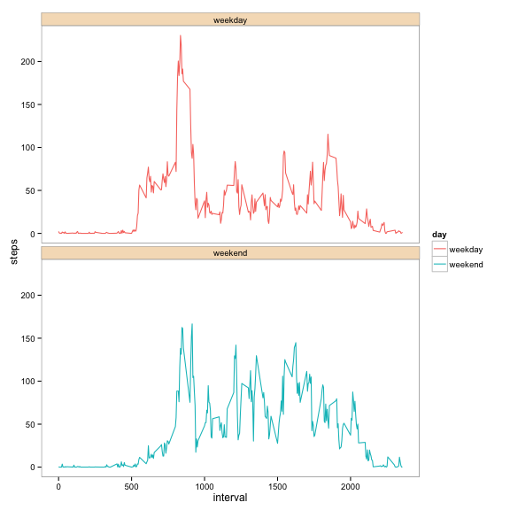

# Reproducible Research: Peer Assessment 1


## Loading and preprocessing the data


```r
dataset<- read.csv("activity.csv",sep=",",header=TRUE,stringsAsFactors = FALSE)
dataset$date<- as.Date(dataset$date,format="%Y-%m-%d" )
```

## What is mean total number of steps taken per day?
#### Histogram of the total number of steps taken each day

```r
stepseachday<-aggregate(steps~date,dataset,sum)
hist(stepseachday$steps,col="light blue",xlab="total # of steps per day", main="Histogram of total # of steps taken each day")
```

 

The mean and median total number of steps taken per day.


```r
meansteps<-mean(stepseachday$steps,na.rm=TRUE)
mediansteps<- median(stepseachday$steps,na.rm=TRUE)
```

In average the person takes 1.0766 &times; 10<sup>4</sup> steps per day and the median steps per day is 10765.

## What is the average daily activity pattern?
#### A time series plot of the 5-minute interval (x-axis) and the average number of steps taken, averaged across all days (y-axis)

```r
newdata<- dataset
d<-aggregate(steps~interval,newdata,mean)
plot(d$steps~d$interval,type="l",col="blue",xlab="Interval",ylab="Avg steps per interval", main="Time series plot ")
```

 

Which 5-minute interval, on average across all the days in the dataset, contains the maximum number of steps?


```r
intervalwithmax<-d[which.max(d$steps),"interval"]
```

The 835th interval contains the maximum number of  average steps that is taken across all the days in the dataset.

## Imputing missing values

```r
good<- complete.cases(dataset)
totalNA<-sum(good==FALSE)
```
The total number of rows with missing values are 2304.

Filling in all of the missing values in the dataset with the average across that interval.


```r
copydataset<-dataset
datawithNA<- copydataset[is.na(copydataset),]
missing<-aggregate(steps~interval,newdata,mean)
for (i in 1:nrow(datawithNA)){
tmp<-datawithNA[i,"interval"]
datawithNA[i,"steps"]=missing[missing$interval==tmp,"steps"]
}
```

A new dataset that is equal to the original dataset but with the missing data filled in.


```r
copydataset<- copydataset[complete.cases(copydataset),]
copydataset<-rbind(datawithNA,copydataset)
```

A histogram of the total number of steps taken each day.  


```r
totalstepseachday<-aggregate(steps~date,copydataset,sum)
hist(totalstepseachday$steps,col="light blue", xlab="total steps each day", main="histogram of the total number of steps taken each day")
```

 


```r
meantotalsteps<-mean(totalstepseachday$steps)
mediantotalsteps<- median(totalstepseachday$steps)
diff<- mediantotalsteps-mediansteps
```

The mean and median total number of steps taken per day for filled data is 1.0766 &times; 10<sup>4</sup> and 1.0766 &times; 10<sup>4</sup>.

This median differ with the dataset where we just removed all the rows with missing values instead of imputing while the mean remain same. 

What is the impact of imputing missing data on the estimates of the total daily number of steps?

The mean total number of steps is same as previous value 1.0766 &times; 10<sup>4</sup> while the median total steps is  increased by 1.1887. 

## Are there differences in activity patterns between weekdays and weekends?

Use the dataset with the filled-in missing values for this part.

A new factor variable in the dataset with two levels – “weekday” and “weekend” indicating whether a given date is a weekday or weekend day.


```r
x<- copydataset
x$day<-weekdays(x$date,abbreviate=TRUE)
x[which(x$day=="Sat"),"day"]="weekend"
x[which(x$day=="Sun"),"day"]="weekend"
x[which(x$day!="weekend"),"day"]="weekday"
x$day<-as.factor(x$day)
```

A panel plot containing a time series plot (i.e. type = "l") of the 5-minute interval (x-axis) and the average number of steps taken, averaged across all weekday days or weekend days (y-axis). 


```r
library(ggplot2)
y<-aggregate(steps~interval+day,x,mean)
ggplot(y,aes(interval,steps))+geom_line(color="blue")+ facet_wrap(~day,nrow=2)+theme_bw()+theme(panel.grid.major=element_blank(),panel.grid.minor=element_blank(),strip.background = element_rect( fill="#F5DEC1"))
```

 
